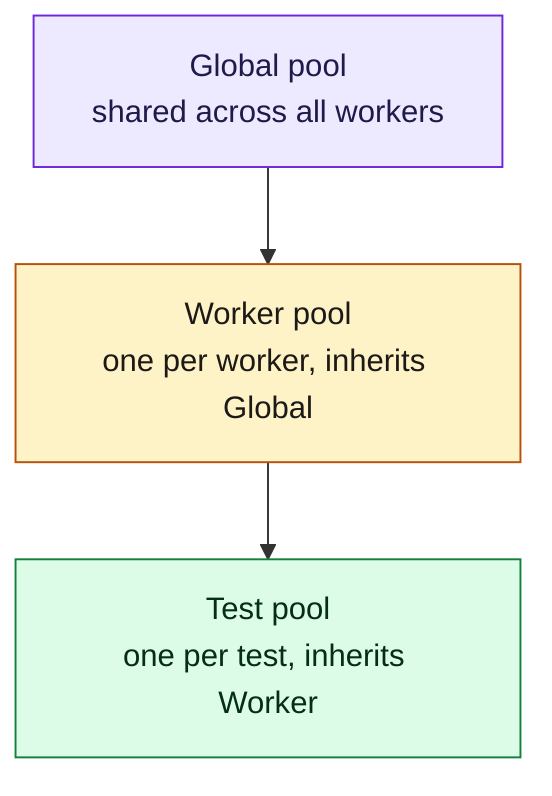
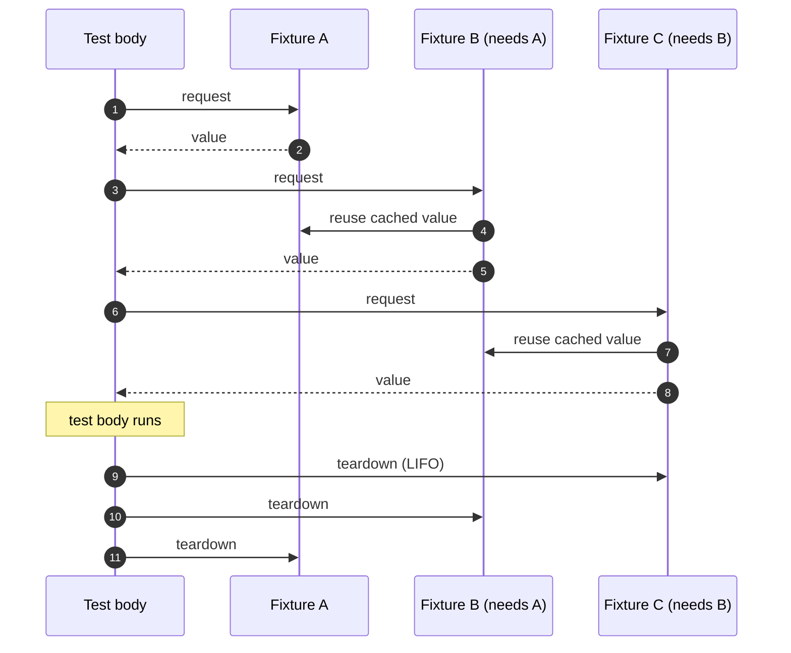

# Fixtures

A fixture is a value injected into your test lazily, with automatic
setup and teardown. ferridriver's fixture system is dependency-injected,
scoped, and DAG-validated at startup — you can compose fixtures on top
of each other without worrying about order.

If you've used Playwright's fixture model, most of this will look
familiar. If you've used pytest, the scope hierarchy will.

## Three scopes



Lookup walks *up* the chain. When your test calls `ctx.browser()`, the
test pool asks its worker parent; the worker caches and reuses it across
tests. When the run ends, teardowns fire in LIFO order.

## Built-in fixtures

You get these for free, no registration needed:

| Name        | Scope  | Type              | What it is |
|-------------|--------|-------------------|------------|
| `browser`   | Worker | `Arc<Browser>`    | Launched once per worker, reused across tests |
| `context`   | Test   | `Arc<BrowserContext>` | Fresh `BrowserContext` per test — isolated storage, cookies, permissions |
| `page`      | Test   | `Arc<Page>`       | Opened in the fresh context |
| `test_info` | Test   | `Arc<TestInfo>`   | Metadata, annotations, step API |

Access them through the `TestContext` bound by `#[ferritest]`:

```rust
#[ferritest]
async fn basic(ctx: TestContext) {
    let browser = ctx.browser().await?;            // worker-scoped, cached
    let context = ctx.browser_context().await?;    // test-scoped, fresh
    let page = ctx.page().await?;                  // test-scoped, fresh
    let info = ctx.test_info().await?;             // test metadata
    // ...
}
```

## Why scopes matter

The scope controls the blast radius of a fixture:

- **Test-scoped fixtures are torn down between tests.** Cookies from
  test A never leak into test B, even on the same worker. No cleanup
  code in your tests.
- **Worker-scoped fixtures amortize expensive setup.** Launching a
  browser takes hundreds of milliseconds; do it once per worker, then
  run hundreds of tests against it.
- **Global fixtures are rare.** Typical use: a test database seeded
  before any test runs, torn down once at the end.

When you write a custom fixture, the scope you pick is the most
important decision. Err toward the *narrowest* scope that lets you
amortize real cost.

## Custom fixtures

Register your own with `#[fixture]`. The function takes a `TestContext`
and returns `ferridriver_test::Result<T>`; the value is shared as
`Arc<T>` and retrieved with `ctx.get::<T>("name")`. Use it for anything
more specialized than the built-ins — seeded test data, a pre-configured
API client, a logged-in session.

```rust
use ferridriver_test::prelude::*;

struct AdminUser {
    name: String,
    email: String,
}

#[fixture(scope = "test")]
async fn admin_user(_ctx: TestContext) -> ferridriver_test::Result<AdminUser> {
    Ok(AdminUser {
        name: "admin".into(),
        email: "admin@example.com".into(),
    })
}
```

Then in a test:

```rust
#[ferritest]
async fn greets_admin(ctx: TestContext) {
    let user = ctx.get::<AdminUser>("admin_user").await?;
    let page = ctx.page().await?;
    page.goto(&format!("/users/{}", user.name)).await?;
    expect(&page.locator("h1")).to_have_text(&user.email).await?;
}
```

The scope argument is `"test"` (default), `"worker"`, or `"global"`. Add
`auto` to force the fixture to resolve for every test in scope even if no
body asks for it, and `timeout = "10s"` to bound setup.

A fixture can depend on other fixtures (built-in or custom) — resolve them
lazily from `ctx` inside the body:

```rust
#[fixture(scope = "test")]
async fn admin_email(ctx: TestContext) -> ferridriver_test::Result<String> {
    let user = ctx.get::<AdminUser>("admin_user").await?;
    Ok(user.email.clone())
}
```

A fixture can also re-expose a configured built-in. Because `ctx.page()`
already hands back an `Arc<Page>`, return that `Arc` and retrieve it with
`ctx.get::<Arc<Page>>("authed_page")`:

```rust
use ferridriver::url_matcher::UrlMatcher;

#[fixture(scope = "test")]
async fn authed_page(ctx: TestContext) -> ferridriver_test::Result<std::sync::Arc<Page>> {
    let page = ctx.page().await?;
    page.goto("https://app.example.com/login").await?;
    page.locator("#email").fill("user@example.com").await?;
    page.locator("button[type=submit]").click().await?;
    page.wait_for_url(UrlMatcher::glob("**/dashboard")?).await?;
    Ok(page)
}
```

## Teardown

A fixture's value is dropped when its scope ends — test-scoped values
after each test, worker-scoped values on worker shutdown — in **LIFO**
order across the pool. Anything that owns a resource (a `Drop` impl, a
spawned task, a temp dir) cleans itself up then. Fixtures built on the
`page` / `context` built-ins inherit their teardown, so closing a context
also tears down everything derived from it. No `afterEach` noise to
remember.



## Hooks vs fixtures

Both run around tests; they solve different problems:

- **Fixtures** are *pull*-based. The test asks for what it needs;
  unused fixtures never run. They carry values.
- **Hooks** are *push*-based. They run for every test in the suite
  whether that test uses them or not. They carry side effects.

If you have a value to inject, make it a fixture. If you have a side
effect that every test needs regardless of the body (metrics tagging,
screenshot on failure, log-capture setup), make it a hook.

## Practical guidance

- **Prefer test-scope over worker-scope.** If a fixture is cheap (tens
  of ms), recreate it. You save a class of "why did this test pollute
  the next one" bugs.
- **Don't hide `ctx.page()` behind a fixture.** `page` is already a
  test-scoped built-in; a custom one would just be an alias.
- **Worker-scope is for things that are truly expensive** — a browser,
  a webdriver session, a seeded database snapshot.
- **Global-scope is for things that are `#[ignore]`-able by design** —
  integration-test infrastructure you start once (a docker-compose
  stack, a migrated DB, a webhook listener).
