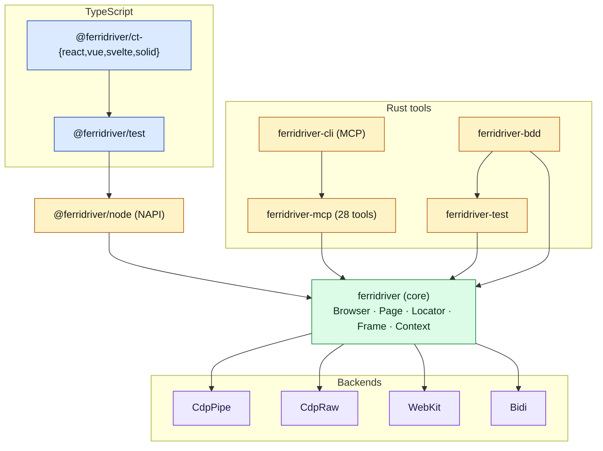
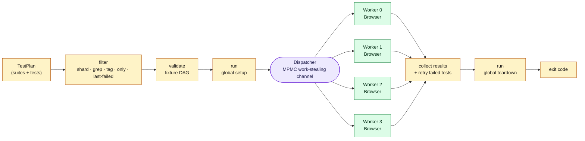
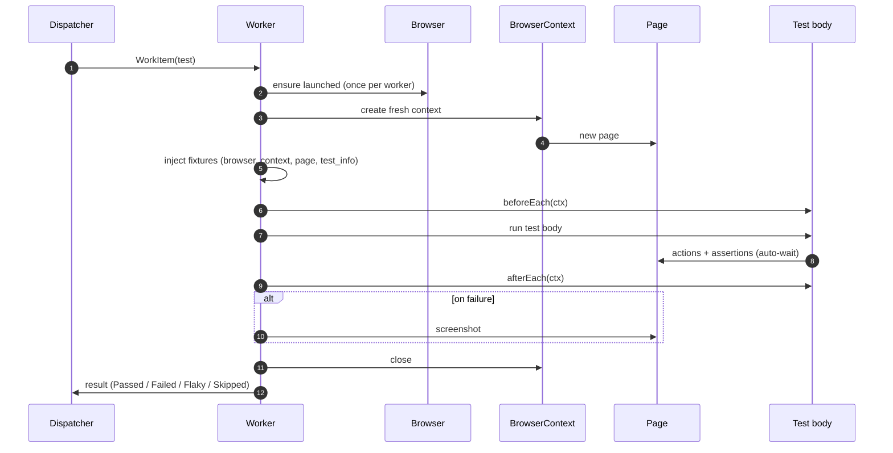

# Architecture

ferridriver is a single Rust engine wrapped in many shapes. The test runner, BDD framework, MCP server, and NAPI bindings don't ship their own browser logic — they all dispatch to the same core. That's where the consistency comes from, and it's also where the speed comes from.

## The layers

The core holds the browser protocol knowledge — nothing above it has to. That's why a Gherkin step, a Rust `#[ferritest]`, and an MCP tool call all reach the same `Page::click` implementation.

## Backends at a glance

Four transports, one API:

| Backend | Browser | Transport | Default? |
|---|---|---|---|
| `cdp-pipe` | Chromium | CDP over fd 3/4 pipes | yes |
| `cdp-raw`  | Chromium | CDP over WebSocket    | |
| `webkit`   | WKWebView (macOS) | Native Obj-C IPC | |
| `bidi`     | Firefox | WebDriver BiDi | |

Backends dispatch through an `enum`, not a trait object. Each call monomorphizes to a single backend path — no vtable lookup, no dynamic dispatch, and the compiler can inline across the boundary. You pay for exactly one backend per process.

See [Concepts → Backends](/concepts/backends) for when to pick which.

## Test execution

Every test — E2E, BDD, component, NAPI — runs through one pipeline: `TestRunner::run()`. The BDD crate translates `.feature` files into the same `TestPlan`. The NAPI test runner delegates to the same Rust function. There is no second runner.

A few consequences worth knowing:

- **Workers launch browsers concurrently**, not sequentially. On a warm machine, overlapping launches save 80–100 ms per extra worker.
- **The dispatcher is work-stealing**. Fast workers pick up more tests. You don't hand-balance anything.
- **Retry re-enqueues**. A failed test goes back on the shared queue, and any worker can grab it — not just the one that failed.

Dive deeper in [Concepts → Parallelism and isolation](/concepts/parallelism-and-isolation).

## A single test, end to end

What actually happens from the moment a worker pulls a test off the queue:

Three things to notice:

- The `Browser` survives between tests. The `BrowserContext` does not.
- `afterEach` runs even when the test body fails. That's how you keep teardown reliable.
- Retry is separate from this loop — a failed test goes back into the dispatcher; you see this same diagram play out again, possibly on a different worker.

## Why the shape is this shape

A few opinionated choices that fall out of the architecture:

- **One engine, many frontends.** Adding a new test style (a new macro, a new DSL, an MCP tool) doesn't fork the execution path. It translates into a `TestPlan` and lets the core handle the rest.
- **Rust owns the hot path.** Polling, actionability checks, selector compilation, CDP transport — all Rust. The TypeScript `expect` wrapper is a thin shim; it issues one NAPI call per assertion and the retry loop stays inside Rust.
- **Per-worker browser, per-test context.** Launching a browser is the most expensive thing you can do. Creating a context is cheap. Amortize the first, refresh the second.
- **Dispatch via enum, not trait object.** Uniform API without the vtable cost.

If you want the file-level map, see the [workspace section of the root README](https://github.com/salamaashoush/ferridriver#workspace).
