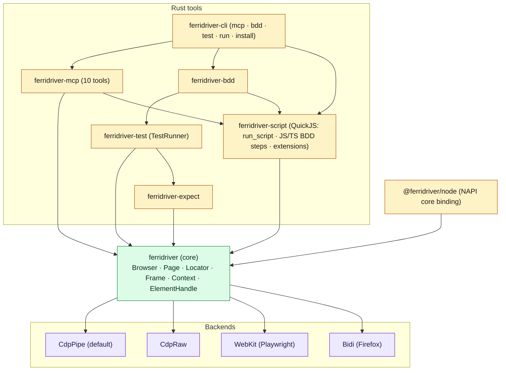
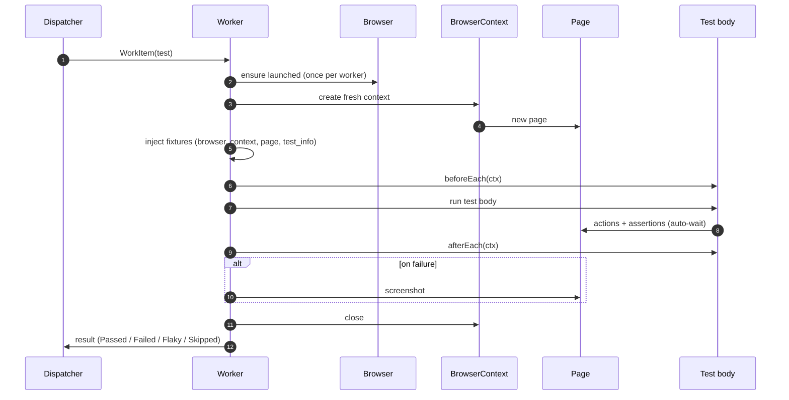

# Architecture

ferridriver is a single Rust engine wrapped in many shapes. The test
runner, BDD framework, MCP server, and NAPI binding don't ship their own
browser logic — they all dispatch to the same core. That is where the
consistency comes from, and it is also where the speed comes from.

## Layers

A Gherkin step, a Rust `#[ferritest]`, an MCP tool call, and a Node.js
`page.click()` all reach the same `Page::click` in `ferridriver`.

## Backends at a glance

| Backend     | Browser            | Transport                                       | Default? |
|-------------|--------------------|--------------------------------------------------|----------|
| `cdp-pipe`  | Chromium / Chrome  | CDP over Unix pipes (fd 3/4)                     | yes      |
| `cdp-raw`   | Chromium / Chrome  | CDP over WebSocket (also supports `Browser::connect`) |     |
| `webkit`    | Playwright WebKit  | Playwright Inspector protocol over `pw_run.sh` (NUL-delimited JSON) | |
| `bidi`      | Firefox            | WebDriver BiDi over WebSocket                    |          |

Backends dispatch through a Rust `enum` (`BackendKind`), not a trait
object. Calls monomorphize to a single backend path — no vtable lookup,
the compiler can inline across the boundary. You pay for exactly one
backend per process.

See [Concepts → Backends](/concepts/backends) for when to pick which.

## Test execution

Every test — Rust `#[ferritest]`, parameterized `#[ferritest_each]`, and
BDD scenarios — runs through one pipeline: `TestRunner::run()`. The BDD
crate translates `.feature` files into the same `TestPlan`; JavaScript /
TypeScript step bodies execute on the embedded QuickJS engine inside that
pipeline. There is no second runner.

A few consequences:

- **Workers launch browsers concurrently** via `tokio::join!`, not
  sequentially. On a warm machine, overlapping launches save 80–100 ms
  per extra worker.
- **The dispatcher is work-stealing**. Fast workers pick up more tests.
  You don't hand-balance anything.
- **Retry re-enqueues**. A failed test goes back on the shared queue —
  any worker can grab it, not just the one that failed.

## A single test, end to end

Three things to notice:

- The `Browser` survives between tests. The `BrowserContext` does not.
- `afterEach` runs even when the test body fails. That is how teardown
  stays reliable.
- Retry is separate from this loop — a failed test goes back into the
  dispatcher; the diagram plays out again, possibly on a different
  worker.

## Why the shape is this shape

- **One engine, many frontends.** Adding a new test style (a new macro,
  a new DSL, an MCP tool) doesn't fork the execution path. It translates
  into a `TestPlan` and lets the core handle the rest.
- **Rust owns the hot path.** Polling, actionability checks, selector
  compilation, CDP transport — all Rust. The TypeScript `expect` wrapper
  is a thin shim that issues one NAPI call per assertion; the retry loop
  stays inside Rust.
- **Per-worker browser, per-test context.** Launching a browser is the
  most expensive thing you can do. Creating a context is cheap. Amortize
  the first, refresh the second.
- **Dispatch via enum, not trait object.** Uniform API without the
  vtable cost.

For the file-level map, see the [workspace section in the root
README](https://github.com/salamaashoush/ferridriver#project-layout).
