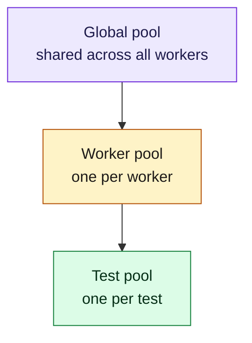

# Fixtures and hooks

Dependency-injected fixtures with three scopes and automatic LIFO teardown. Hooks attach to the suite or test lifecycle.

## Built-in fixtures

| Name | Scope | Type |
|---|---|---|
| `browser` | Worker | `Arc<Browser>` |
| `context` | Test | `Arc<ContextRef>` |
| `page` | Test | `Arc<Page>` |
| `test_info` | Test | `Arc<TestInfo>` |

## Scope hierarchy



`pool.get::<T>("name")` walks the scope chain, resolves dependencies recursively, caches values, and registers teardown. The DAG is validated at startup.

## Hooks

All hook macros (`#[before_all]`, `#[after_all]`, `#[before_each]`, `#[after_each]`) take no attributes. Every hook receives a `TestContext` — name it however you like. Suite hooks (`before_all` / `after_all`) run once per suite per worker; each hooks (`before_each` / `after_each`) run for every test.

```rust
use ferridriver_test::prelude::*;

#[before_all]
async fn setup_db(ctx: TestContext) {
    // Once per suite per worker, before any test runs.
}

#[after_all]
async fn teardown_db(ctx: TestContext) {
    // Once per suite per worker, after all tests finish.
}

#[before_each]
async fn set_auth(ctx: TestContext) {
    // Runs for every test. Fetch fixtures via ctx.page(), ctx.context(), etc.
    let context = ctx.context().await?;
    context.add_cookies(vec![/* ... */]).await?;
}

#[after_each]
async fn dump_logs(ctx: TestContext) {
    // Always runs, even on failure.
}
```

## Per-test lifecycle

```mermaid
sequenceDiagram
  autonumber
  participant W as Worker
  participant S as Suite hooks
  participant T as Test body
  participant F as Fixtures

  S->>W: beforeAll (once per worker per suite)
  loop each test
    W->>F: create fresh context + page
    W->>F: inject browser, context, page, test_info
    W->>T: beforeEach
    W->>T: run body (timeout; 3x for @slow)
    W->>T: afterEach (runs even on failure)
    alt test failed
      W->>W: screenshot
    end
    W->>F: close context + teardown fixtures (LIFO)
  end
  W->>S: afterAll (on worker shutdown)
```
