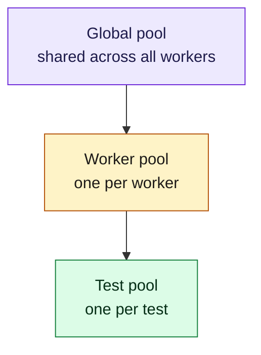

# Fixtures and hooks

Dependency-injected fixtures with three scopes and automatic LIFO
teardown. Hooks attach to the suite or test lifecycle.

## Built-in fixtures

| Name        | Scope  | Type              |
|-------------|--------|-------------------|
| `browser`   | Worker | `Arc<Browser>`    |
| `context`   | Test   | `Arc<ContextRef>` |
| `page`      | Test   | `Arc<Page>`       |
| `test_info` | Test   | `Arc<TestInfo>`   |

## Scope hierarchy



`pool.get::<T>("name")` walks the scope chain, resolves dependencies
recursively, caches values, and registers teardown. The DAG is validated
at startup.

## Hooks

All hook macros (`#[before_all]`, `#[after_all]`, `#[before_each]`,
`#[after_each]`) take no attributes. Every hook receives a
`TestContext` — name it however you like. Suite hooks (`before_all` /
`after_all`) run once per suite per worker; each hooks (`before_each` /
`after_each`) run for every test.

```rust
use ferridriver_test::prelude::*;

#[before_all]
async fn setup_db(ctx: TestContext) {
    // Once per suite per worker, before any test runs.
}

#[after_all]
async fn teardown_db(ctx: TestContext) {
    // Once per suite per worker, after all tests finish.
}

#[before_each]
async fn set_auth(ctx: TestContext) {
    let context = ctx.browser_context().await?;
    context.add_cookies(vec![/* ... */]).await?;
}

#[after_each]
async fn dump_logs(ctx: TestContext) {
    // Always runs, even on failure.
}
```

## Per-test lifecycle

```mermaid
sequenceDiagram
  autonumber
  participant W as Worker
  participant S as Suite hooks
  participant T as Test body
  participant F as Fixtures

  S->>W: beforeAll (once per worker per suite)
  loop each test
    W->>F: create fresh context + page
    W->>F: inject browser, context, page, test_info
    W->>T: beforeEach
    W->>T: run body (timeout; 3x for slow)
    W->>T: afterEach (runs even on failure)
    alt test failed
      W->>W: screenshot
    end
    W->>F: close context + teardown fixtures (LIFO)
  end
  W->>S: afterAll (on worker shutdown)
```

## Custom fixtures

Use the `#[fixture]` attribute to register a custom value. The body takes
a `TestContext`, returns `ferridriver_test::Result<T>`, and the value is
shared as `Arc<T>`. Retrieve it from a test with `ctx.get::<T>("name")`.

```rust
use ferridriver_test::prelude::*;

struct AdminUser {
    name: String,
    email: String,
}

#[fixture(scope = "test")]
async fn admin_user(_ctx: TestContext) -> ferridriver_test::Result<AdminUser> {
    Ok(AdminUser {
        name: "admin".into(),
        email: "admin@example.com".into(),
    })
}
```

```rust
#[ferritest]
async fn shows_admin(ctx: TestContext) {
    let user = ctx.get::<AdminUser>("admin_user").await?;
    let page = ctx.page().await?;
    page.goto(&format!("/users/{}", user.name), None).await?;
    expect(&page.locator("h1", None)).to_have_text(&user.email).await?;
}
```

`scope` is `"test"` (default), `"worker"`, or `"global"`; add `auto` to
resolve the fixture for every test in scope, and `timeout = "10s"` to
bound setup. Fixtures can depend on built-in or other custom fixtures —
resolve them lazily with `ctx.get` inside the body. The fixture DAG is
validated at startup: a cycle aborts the run before any test starts.

## Hooks vs fixtures

Both run around tests; they solve different problems:

- **Fixtures** are *pull*-based. The test asks for what it needs;
  unused fixtures never run. They carry values.
- **Hooks** are *push*-based. They run for every test in the suite
  whether the test uses them or not. They carry side effects.

If you have a value to inject, make it a fixture. If you have a side
effect that every test needs regardless of the body (metrics tagging,
screenshot on failure, log-capture setup), make it a hook.

## Practical guidance

- **Prefer test-scope over worker-scope.** If a fixture is cheap (tens
  of ms), recreate it. You save a class of "why did this test pollute
  the next one" bugs.
- **Don't hide `ctx.page()` behind a fixture.** `page` is already a
  test-scoped built-in; a custom one would just be an alias.
- **Worker-scope is for things that are truly expensive** — a browser,
  a webdriver session, a seeded database snapshot.
- **Global-scope is for things that are `#[ignore]`-able by design** —
  integration-test infrastructure you start once (a docker-compose
  stack, a migrated DB, a webhook listener).
